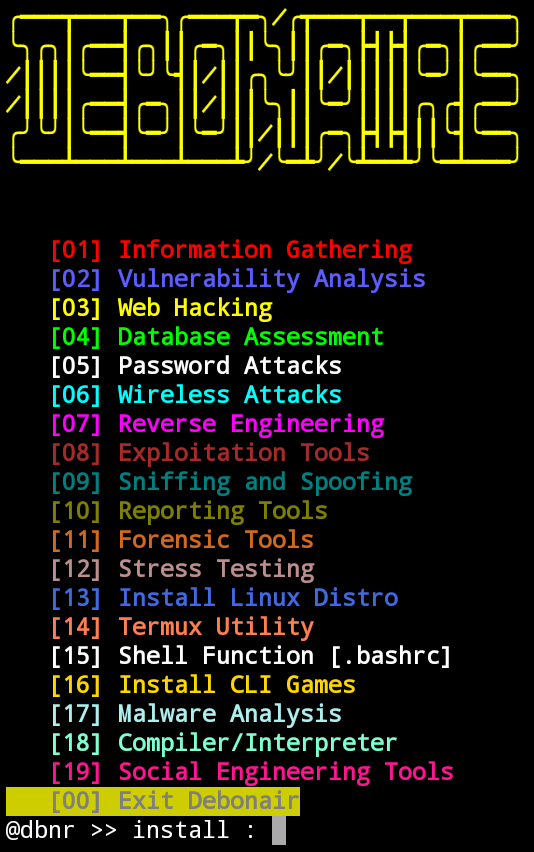

<h1>Debonair</h2>

---

### Introduction
> :information_source: Debonair is an all in one, across the board and automatic installer for helpful tools.

## Installation⬇️
 

1. Clone the project files and cd into the directory:

        git clone https://github.com/secretum-inc/debonair && cd debonair

2. Run:
     
        python3 init.py

## Tool Categories🚥
`Information Gathering`
`Vulnerability Scanner/Analysis`
`Web hacking`
`Database Assessment`
`Password Attacks`
`Wireless Attacks`
`Reverse Engineering`
`Exploitation Tools`
`Sniffing & Spoofing`
`Reporting Tools`
`Forensic Tools`
`Stress Testing`
`Linux Distos`
`Termux Utility`
`Shell Function [.bashrc]`
`CLI Games`
`Malware Analysis`
`Compiler/Interpreter`
`Social Engineering Tools`

## How to use👨‍💻

Type **`debonair`** or **`dbnr`** from anywhere in your terminal

:bulb: Each number represents a specific output.

:bulb: Type the number corresponding number of a tool which you want to install.

## Requirements🎲
• Python **3.6+**

• quo **2021.×**

## Contributing👥

If you run into an issue, we would be very happy if you would file a bug on the [issue tracker](https://github.com/secretum-inc/debonair/issues). You can also contribute by adding more tools by creating a pull request

## License📑

Debonair is licensed under Apache-2.0 License. See the `LICENSE` file in the top distribution directory for the full license text.

## Donate🎁

Please consider [Donating](https://www.paypal.com/donate?hosted_button_id=KP893BC2EKK54) today

------------------------------------------------------------------------

